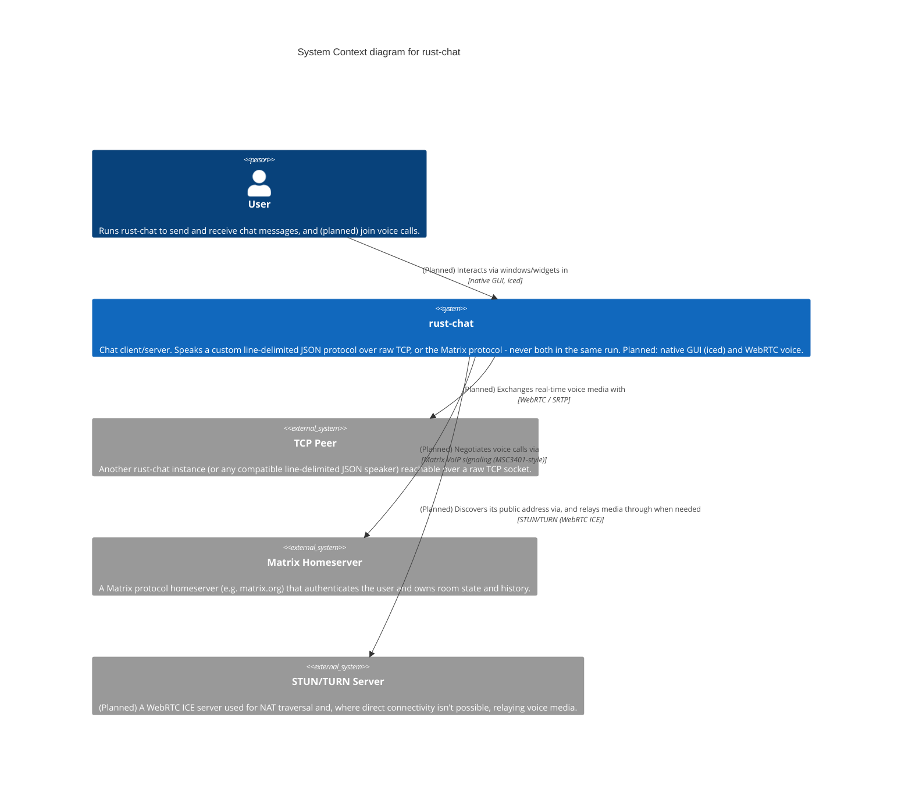

# Level 1 — System Context — rust-chat

> **Diagram type**: System Context
> **Scope**: rust-chat as seen from the outside — who runs it and which external systems it talks to.
> **Audience**: Everyone (technical and non-technical); suitable for anyone orienting to the project for the first time.

## Overview

rust-chat is a terminal chat client/server written in Rust. A user runs it from the command line in exactly one of three modes per invocation: as a TCP server waiting for a single incoming connection, as a TCP client connecting out to a peer, or as a Matrix client authenticating against a Matrix homeserver. It holds no durable state of its own and has no UI beyond the terminal today — every session is ephemeral and entirely driven by whichever external system it's talking to for that run.

Two changes are **planned but not yet implemented**: a native GUI frontend built with [iced](https://iced.rs) (retained-mode, Elm-architecture) to replace the current terminal interface, and a real-time voice channel capability built on WebRTC. Both are captured on this diagram, clearly marked as planned, so the target shape is visible alongside what exists today.

This diagram answers *"what is rust-chat, and what does it interact with?"* before any decomposition into containers or components.

## Diagram

## Legend

- **Person / actor**: human user of the system
- **System (in scope)**: rust-chat — the subject of this diagram
- **External system**: out-of-scope system rust-chat interacts with (TCP Peer, Matrix Homeserver, STUN/TURN Server)
- **(Planned)**: element or relationship that is a planned direction, not yet implemented — see the Elements/Key relationships **Status** column
- No custom colors, shapes, or border styles used — Mermaid C4 default rendering

## Elements

| Element | Type | Technology | Status | Responsibility |
|---|---|---|---|---|
| User | Person | — | Current | Runs rust-chat; the only human actor. |
| rust-chat | System (in scope) | Rust, Tokio | Current, evolving | Chat client/server. Picks one of two independent transports per invocation (raw TCP or Matrix) — detailed at Container/Component level. |
| TCP Peer | System_Ext | — (any line-delimited JSON speaker) | Current | The other end of a direct TCP chat session. The protocol is symmetric, so a "peer" is typically just another rust-chat instance. |
| Matrix Homeserver | System_Ext | Matrix Client-Server API | Current | Owns rooms, membership, and message history. rust-chat is a thin client against it. |
| STUN/TURN Server | System_Ext | STUN/TURN (WebRTC ICE) | **Planned** | NAT traversal and media relay for the planned voice capability. No specific operator chosen yet — see Assumptions. |

## Key relationships

| From | To | Intent | Protocol / Technology | Status |
|---|---|---|---|---|
| User | rust-chat | Issues commands to and reads chat output from | CLI / terminal | Current |
| User | rust-chat | Interacts via windows/widgets in | native GUI, iced | **Planned** |
| rust-chat | TCP Peer | Exchanges line-delimited JSON chat envelopes with | raw TCP | Current |
| rust-chat | TCP Peer | Exchanges real-time voice media with | WebRTC / SRTP | **Planned** |
| rust-chat | Matrix Homeserver | Authenticates, syncs room state with, and sends/receives messages via | Matrix Client-Server API / HTTPS | Current |
| rust-chat | Matrix Homeserver | Negotiates voice calls via | Matrix VoIP signaling (MSC3401-style) | **Planned** |
| rust-chat | STUN/TURN Server | Discovers public address via, relays media through when needed | STUN/TURN (WebRTC ICE) | **Planned** |

## Notable architectural decisions

- **Two independent transports, chosen at invocation, not at runtime.** Which external system rust-chat talks to is fixed by the CLI subcommand (`server`/`client`/`matrix`) for the entire process lifetime — a single run never talks to both a TCP peer and a Matrix homeserver. This is the project's central design choice, and it's already visible at Context level.
- **No system of record inside rust-chat.** For the TCP transport, the relationship is genuinely peer-to-peer — either side could be "the client." For Matrix, the homeserver is the actual system of record for room state and history; rust-chat caches nothing durably.
- **(Planned) iced over a terminal, a different native GUI toolkit, or a web frontend.** iced's retained-mode rendering plus `Subscription`-based async integration is the better structural match for the existing `poll_events`-shaped backend abstraction than an immediate-mode GUI (egui), and it avoids the network/serialization overhead and new HTTP/WebSocket gateway a web frontend would require, given rust-chat currently exposes no such API.
- **(Planned) WebRTC over a hand-rolled voice protocol.** `webrtc-rs` provides ICE/STUN/TURN NAT traversal, the Opus codec, and DTLS-SRTP encryption without reimplementing them. It also opens a path to interoperating with Matrix's own WebRTC-based calling, since the Matrix backend already exists here.
- **(Planned) Voice is a separate capability, not folded into the existing chat abstraction.** Call signaling and real-time media don't fit the `join_room`/`send_message`/`poll_events` shape used for text chat — this is elaborated at Component level (Level 3).

## Assumptions

- "TCP Peer" is drawn as a single external system for simplicity. In practice a `server` run accepts exactly one incoming connection and a `client` run connects to exactly one address — there is no multi-peer fan-out today. This is confirmed from the code (`P2PBackend::listen`/`connect`), not inferred.
- Matrix Homeserver's specific identity (which server) is supplied by the user at the CLI (`--homeserver`); this diagram represents the class of external system, not a specific instance.
- **(Planned items, not yet decided):** who operates the STUN/TURN server (self-hosted `coturn`, a public/free STUN server plus a paid TURN fallback, or something else) is unresolved. Whether voice signaling for the TCP-peer path reuses the existing raw-TCP connection, needs its own signaling channel, or is deferred until the peer transport is revisited is also unresolved. These are flagged here rather than guessed at in the diagram.

## Links to other levels

- ↓ [Level 2 — Container diagram](./02-container.md) — zoom inside rust-chat (spoiler: it's one container)
