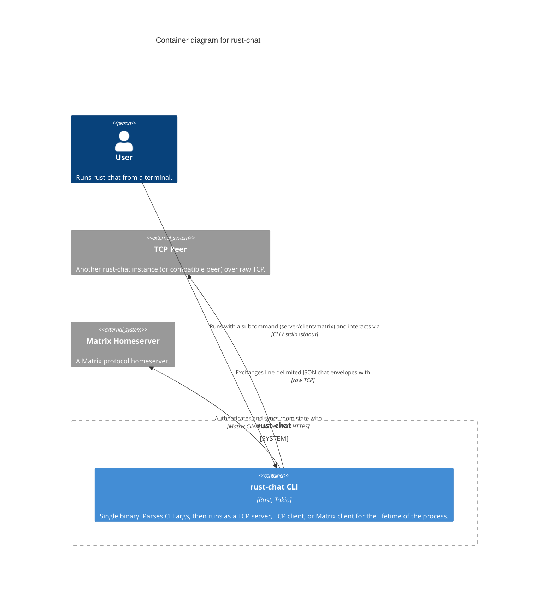

# Level 2 — Container — rust-chat

> **Diagram type**: Container
> **Scope**: The independently deployable process(es) that implement rust-chat.
> **Audience**: Technical team — developers, anyone reasoning about how the system is deployed and run.

## Overview

rust-chat ships as a single deployable process: one Rust binary built on Tokio's async runtime. There is no separate server process, database, or message queue — the `server` and `client` CLI subcommands are two invocations of the exact same binary, and `matrix` is a third. Because there is exactly one container, this level is intentionally thin and reads almost as a restatement of the Context diagram. The system's actual internal structure — the trait-based backend abstraction that lets one binary speak two unrelated protocols — only becomes visible at Component level.

## Diagram

## Legend

- **Person / actor**: human user of the system
- **System boundary** (rounded rectangle): the scope of rust-chat
- **Container**: independently deployable application — here, just one
- **External system**: out-of-scope system rust-chat interacts with (TCP Peer, Matrix Homeserver)
- No custom colors or border styles — Mermaid C4 default rendering

## Elements

| Element | Type | Technology | Responsibility |
|---|---|---|---|
| User | Person | — | Runs the binary; interacts entirely through the terminal. |
| rust-chat CLI | Container | Rust, Tokio | The whole system, as one process. Owns process lifetime, the async runtime, and both transport implementations. |
| TCP Peer | External System | — | The other end of a direct TCP chat session. |
| Matrix Homeserver | External System | Matrix Client-Server API | System of record for room state and history. |

## Key relationships

| From | To | Intent | Protocol / Technology |
|---|---|---|---|
| User | rust-chat CLI | Runs with a subcommand and interacts via | CLI / stdin+stdout |
| rust-chat CLI | TCP Peer | Exchanges line-delimited JSON chat envelopes with | raw TCP |
| rust-chat CLI | Matrix Homeserver | Authenticates and syncs room state with | Matrix Client-Server API / HTTPS |

## Notable architectural decisions

- **Single-binary design.** No separate processes to deploy or coordinate. Trade-off: a running process can only be "one thing" — you cannot act as both a TCP server and a Matrix client simultaneously without starting two separate OS processes.
- **No persistence container.** Neither transport gets a local database. The only state that outlives a single poll iteration — which room the user is currently in — lives in-memory inside the interactive loop for the life of the process (see Component level).

## Assumptions

- None beyond what Level 1 already assumes. The container boundary is unambiguous for a single-binary CLI tool — there is nothing to infer here.

## Links to other levels

- ↑ [Level 1 — System Context](./01-context.md) — zoom out to actors and external systems
- ↓ [Level 3 — Component diagram for the rust-chat CLI container](./03-component-rust-chat-cli.md) — where the actual design (the `ChatBackend` trait, its two implementations, and the shared protocol module) becomes visible
