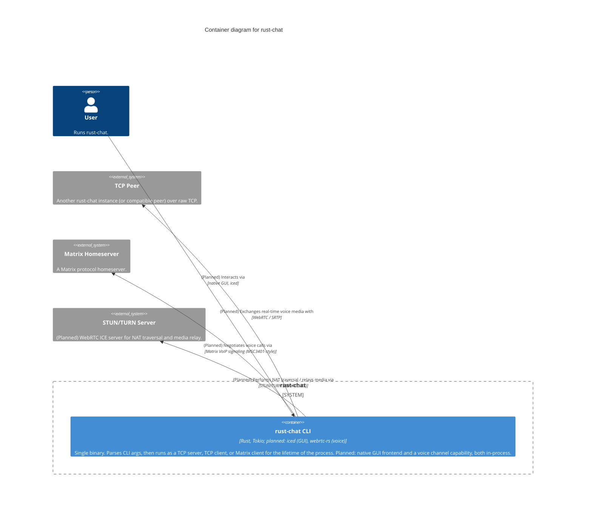

# Level 2 — Container — rust-chat

> **Diagram type**: Container
> **Scope**: The independently deployable process(es) that implement rust-chat.
> **Audience**: Technical team — developers, anyone reasoning about how the system is deployed and run.

## Overview

rust-chat ships as a single deployable process: one Rust binary built on Tokio's async runtime. There is no separate server process, database, or message queue — the `server` and `client` CLI subcommands are two invocations of the exact same binary, and `matrix` is a third. Because there is exactly one container, this level is intentionally thin and reads almost as a restatement of the Context diagram. The system's actual internal structure — the trait-based backend abstraction that lets one binary speak two unrelated protocols — only becomes visible at Component level.

Two capabilities are **planned but not yet implemented**, and both are expected to stay inside this same single-binary container rather than introduce a new deployable process: a native GUI frontend (iced) replacing the terminal interface, and a WebRTC-based voice channel. Container-level scope doesn't change — one process, one binary — but the technology list and external relationships grow to reflect the plan.

## Diagram

## Legend

- **Person / actor**: human user of the system
- **System boundary** (rounded rectangle): the scope of rust-chat
- **Container**: independently deployable application — here, just one
- **External system**: out-of-scope system rust-chat interacts with (TCP Peer, Matrix Homeserver, STUN/TURN Server)
- **(Planned)**: element or relationship that is a planned direction, not yet implemented — see the Elements/Key relationships **Status** column
- No custom colors or border styles — Mermaid C4 default rendering

## Elements

| Element | Type | Technology | Status | Responsibility |
|---|---|---|---|---|
| User | Person | — | Current | Runs the binary; interacts through the terminal today, planned to gain a GUI. |
| rust-chat CLI | Container | Rust, Tokio; planned: iced, webrtc-rs | Current, evolving | The whole system, as one process. Owns process lifetime, the async runtime, both transport implementations, and (planned) the GUI and voice capability. |
| TCP Peer | External System | — | Current | The other end of a direct TCP chat session. |
| Matrix Homeserver | External System | Matrix Client-Server API | Current | System of record for room state and history. |
| STUN/TURN Server | External System | STUN/TURN (WebRTC ICE) | **Planned** | NAT traversal and media relay for voice. |

## Key relationships

| From | To | Intent | Protocol / Technology | Status |
|---|---|---|---|---|
| User | rust-chat CLI | Runs with a subcommand and interacts via | CLI / stdin+stdout | Current |
| User | rust-chat CLI | Interacts via | native GUI, iced | **Planned** |
| rust-chat CLI | TCP Peer | Exchanges line-delimited JSON chat envelopes with | raw TCP | Current |
| rust-chat CLI | TCP Peer | Exchanges real-time voice media with | WebRTC / SRTP | **Planned** |
| rust-chat CLI | Matrix Homeserver | Authenticates and syncs room state with | Matrix Client-Server API / HTTPS | Current |
| rust-chat CLI | Matrix Homeserver | Negotiates voice calls via | Matrix VoIP signaling (MSC3401-style) | **Planned** |
| rust-chat CLI | STUN/TURN Server | Performs NAT traversal / relays media via | STUN/TURN (WebRTC ICE) | **Planned** |

## Notable architectural decisions

- **Single-binary design.** No separate processes to deploy or coordinate. Trade-off: a running process can only be "one thing" — you cannot act as both a TCP server and a Matrix client simultaneously without starting two separate OS processes.
- **No persistence container.** Neither transport gets a local database. The only state that outlives a single poll iteration — which room the user is currently in — lives in-memory inside the interactive loop for the life of the process (see Component level).
- **(Planned) GUI and voice both stay in-process, not new containers.** iced (GUI) and `webrtc-rs` (voice) are both pure-Rust, embeddable libraries — neither requires an external process, a browser, or a server component to run. This preserves the single-binary deployment story; it does not become a client/server split.
- **(Planned) No new backend/gateway process for the GUI.** Because iced calls `ChatBackend` in-process rather than over a network API, this container diagram doesn't gain an API gateway or additional container the way a web-frontend option would have required.

## Assumptions

- None beyond what Level 1 already assumes. The container boundary is unambiguous for a single-binary CLI tool — there is nothing to infer here.
- **(Planned)** Voice is assumed to run inside the same process/container as everything else, consistent with how both existing transports work today. If voice media processing turns out to need dedicated resource isolation (e.g. a separate process for crash containment), that would be a container-level change revisited at that time — not assumed now.

## Links to other levels

- ↑ [Level 1 — System Context](./01-context.md) — zoom out to actors and external systems
- ↓ [Level 3 — Component diagram for the rust-chat CLI container](./03-component-rust-chat-cli.md) — where the actual design (the `ChatBackend` trait, its two implementations, the shared protocol module, and the planned GUI/voice components) becomes visible
