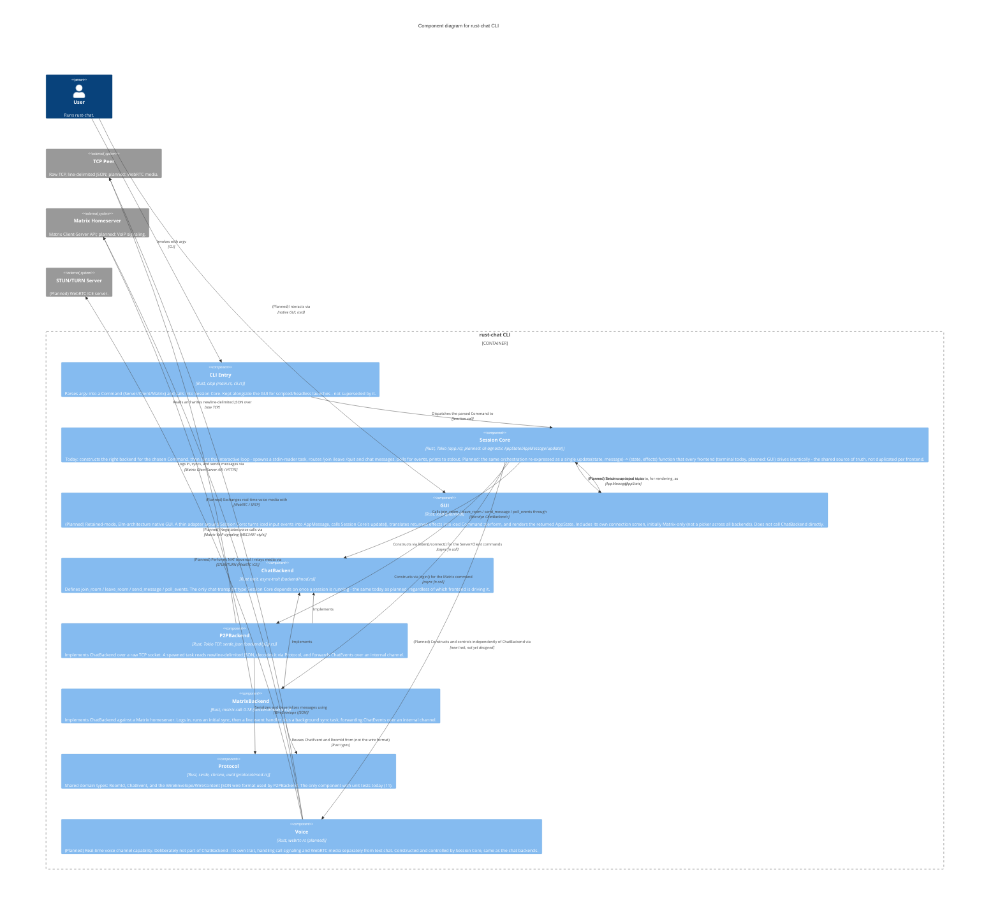

# Level 3 — Component — rust-chat CLI

> **Diagram type**: Component
> **Scope**: The internal components of the `rust-chat CLI` container — CLI parsing, orchestration, the backend abstraction and its two implementations, the shared protocol module, and the planned GUI and voice components.
> **Audience**: Developers working on this codebase.

## Overview

Inside the single `rust-chat CLI` container, the system is built around one abstraction: the `ChatBackend` trait (`join_room`, `leave_room`, `send_message`, `poll_events`). Everything else follows from it. The **Session Core** never talks to `P2PBackend` or `MatrixBackend` directly except at construction time — for the rest of a session it holds a `Box<dyn ChatBackend>` and calls only trait methods. This is what lets the same interactive loop, the same `/join`/`/leave`/`/quit` handling, and the same event-printing code serve both a raw-TCP chat session and a Matrix session without knowing which one it's driving.

Both backend implementations follow the same internal pattern: a spawned background task owns the actual I/O (a TCP socket reader, or a matrix-sdk sync loop), decodes whatever it receives into a `ChatEvent`, and forwards it over an internal `mpsc` channel (Tokio's multi-producer, single-consumer channel type). `poll_events()` just drains that channel non-blockingly; the Session Core calls it on a ~50ms loop rather than awaiting per-backend futures directly, which is what keeps `ChatBackend`'s interface uniform across two very different transports.

The `Protocol` component is shared, but not equally: `P2PBackend` uses its `WireEnvelope`/`WireContent` JSON wire format directly (it *is* the wire protocol for raw TCP), while `MatrixBackend` only reuses the domain types (`ChatEvent`, `RoomId`) — matrix-sdk owns its own wire format against the Matrix Client-Server API.

**Two components are planned, not yet built, and one existing component is planned to change role.** Orchestration (backend construction, command routing, event interpretation) is planned to become a **shared, UI-agnostic core**: today's `app.rs` — renamed here from "App Orchestrator" to **Session Core** to reflect that target shape — is planned to expose a single `update(state, message) -> (state, effects)` function, in the Elm/Redux sense, that any frontend can drive identically. The planned **GUI** component (iced) becomes a thin adapter around it: it turns iced input events into `AppMessage`, calls Session Core's `update()`, translates the returned effects into iced's own async primitive (`Command::perform`), and renders the returned `AppState`. GUI is deliberately **not** shown calling `ChatBackend` directly anymore — that stays exclusively Session Core's responsibility, current and planned alike. The separate **Voice** component (`webrtc-rs`) is planned for real-time voice; it is deliberately **not** part of `ChatBackend` — signaling and media don't fit `join_room`/`send_message`/`poll_events` — and, per the same shared-core decision, is constructed and controlled by Session Core rather than by whichever frontend happens to be active. `CLI Entry` is planned to stay, alongside the GUI: scripted/headless launches (`rust-chat server --port 9000`) keep working via argv, and the GUI gains its own connection screen for interactive use — both are just two different producers of the same initial `Command`/`AppMessage` that Session Core consumes identically. The GUI's initial scope is **Matrix only** — its connection screen is a Matrix login form (homeserver/user id/password), not a picker across all three `Command` variants, and backend choice stays one-shot per run, same as today. TCP (`server`/`client`) stays CLI/terminal-only for now; a GUI picker across backends, and switching backend without restarting, are both explicitly deferred. What's still genuinely open — see Assumptions: the exact shape of the new voice trait, and the concrete `AppState`/`AppMessage`/`update()` API.

## Diagram

## Legend

- **Person / actor**: human user of the system
- **Container boundary** (rounded rectangle): the `rust-chat CLI` container from Level 2
- **Component**: a logical module inside that container (roughly, one `src/` file or directory)
- **External system**: out-of-scope system a component talks to directly
- `mpsc` in component descriptions refers to Tokio's `tokio::sync::mpsc` channel type
- **(Planned)**: element or relationship that is a planned direction, not yet implemented — see the Elements/Key relationships **Status** column
- No custom colors or border styles — Mermaid C4 default rendering

## Elements

| Element | Type | Technology | Status | Responsibility |
|---|---|---|---|---|
| User | Person | — | Current | Invokes the binary with a subcommand; reads/writes via stdin+stdout during the session today. |
| CLI Entry | Component | Rust, clap | Current, stays | Parses argv into `Command::{Server, Client, Matrix}`, prints the initial connection message, hands off to Session Core. Planned to remain the entry point for scripted/headless launches once the GUI exists, not be superseded by it. |
| Session Core | Component | Rust, Tokio; planned: shared `AppState`/`AppMessage`/`update()` | Current, planned to be re-expressed | Owns all session orchestration: constructs the chat backend (and, planned, voice), routes commands, interprets events. Today expressed as a terminal-bound interactive loop; planned to become a single UI-agnostic `update()` function every frontend drives identically. |
| GUI | Component | Rust, iced | **Planned**, scoped to Matrix initially | Thin adapter around Session Core: iced input → `AppMessage`, Session Core's `update()` → effects, effects → `iced::Command::perform`, `AppState` → rendered view. Connection screen is Matrix-login-only for the initial version; TCP stays CLI/terminal-only for now. Holds no orchestration logic of its own. |
| ChatBackend | Component (trait) | Rust trait, async-trait | Current | The abstraction boundary. `#[async_trait]` makes it usable as `Box<dyn ChatBackend>` despite async methods. Called exclusively by Session Core, not by any frontend directly. |
| P2PBackend | Component | Rust, Tokio TCP, serde_json | Current | Raw-TCP transport. Owns a `TcpStream`/socket split, a background line-reader task, and the JSON encode/decode via `WireEnvelope`. |
| MatrixBackend | Component | Rust, matrix-sdk 0.18 | Current | Matrix transport. Owns a matrix-sdk `Client`, a live event handler closure, and a background sync task. |
| Protocol | Component | Rust, serde, chrono, uuid | Current | Domain types (`RoomId`, `ChatEvent`) and the P2P wire format (`WireEnvelope`, `WireContent`, `PROTOCOL_VERSION`). |
| Voice | Component | Rust, webrtc-rs | **Planned** | Real-time voice channel capability, kept separate from `ChatBackend`, constructed by Session Core. |
| TCP Peer | External System | — | Current | Raw TCP endpoint speaking the same line-delimited JSON protocol. |
| Matrix Homeserver | External System | Matrix Client-Server API | Current | Owns rooms, membership, message history. |
| STUN/TURN Server | External System | STUN/TURN (WebRTC ICE) | **Planned** | NAT traversal and media relay for voice. |

## Key relationships

| From | To | Intent | Protocol / Technology | Status |
|---|---|---|---|---|
| User | CLI Entry | Invokes with argv | CLI | Current |
| User | GUI | Interacts via | native GUI, iced | **Planned** |
| CLI Entry | Session Core | Dispatches the parsed Command to | function call | Current |
| GUI | Session Core | Sends user input to, as | `AppMessage` | **Planned** |
| Session Core | GUI | Returns updated state to, for rendering, as | `AppState` | **Planned** |
| Session Core | P2PBackend | Constructs via `listen()`/`connect()` for the Server/Client commands | async fn call | Current |
| Session Core | MatrixBackend | Constructs via `login()` for the Matrix command | async fn call | Current |
| Session Core | ChatBackend | Calls `join_room`/`leave_room`/`send_message`/`poll_events` through | `Box<dyn ChatBackend>` | Current |
| P2PBackend | ChatBackend | Implements | — | Current |
| MatrixBackend | ChatBackend | Implements | — | Current |
| P2PBackend | Protocol | Serializes and deserializes messages using | `WireEnvelope` (JSON) | Current |
| MatrixBackend | Protocol | Reuses `ChatEvent`/`RoomId` from (not the wire format) | Rust types | Current |
| P2PBackend | TCP Peer | Reads and writes newline-delimited JSON over | raw TCP | Current |
| MatrixBackend | Matrix Homeserver | Logs in, syncs, and sends messages via | Matrix Client-Server API / HTTPS | Current |
| Session Core | Voice | Constructs and controls independently of ChatBackend via | new trait, not yet designed | **Planned** |
| Voice | TCP Peer | Exchanges real-time voice media with | WebRTC / SRTP | **Planned** |
| Voice | Matrix Homeserver | Negotiates voice calls via | Matrix VoIP signaling (MSC3401-style) | **Planned** |
| Voice | STUN/TURN Server | Performs NAT traversal / relays media via | STUN/TURN (WebRTC ICE) | **Planned** |

## Notable architectural decisions

- **`Box<dyn ChatBackend>` over a generic parameter.** Which backend to construct is a runtime decision — it depends on which CLI subcommand the user picked — not something known at compile time. A generic `run_interactive<B: ChatBackend>` would need the concrete type at the call site, which doesn't exist yet when `Command::Server`/`Client`/`Matrix` are still just enum variants. Dynamic dispatch is the correct call here, not a compromise.
- **`WireEnvelope` is P2P-only, not a universal wire format.** `MatrixBackend` deliberately does not go through `Protocol`'s JSON envelope — matrix-sdk already owns wire-level concerns against the Matrix Client-Server API. `Protocol` only supplies the domain types both backends need to agree on (`ChatEvent`, `RoomId`) so `app.rs` can stay backend-agnostic.
- **Polling instead of a unified async event stream.** Both backends push into an internal `mpsc` channel from a background task, and `poll_events()` just drains it non-blockingly on a fixed ~50ms cadence from Session Core's loop. This keeps `ChatBackend`'s interface simple and identical across two structurally different transports, at the cost of up to ~50ms of added latency and a busy-ish poll loop rather than a true `select!` over backend-provided futures.
- **Test coverage is uneven.** `Protocol` has 11 unit tests covering `into_chat_event`'s branches, the constructors, `RoomId`, and a JSON round-trip. `P2PBackend` and `MatrixBackend` — where the actual I/O, parsing, and matrix-sdk integration happen — have none yet. This is tracked as ongoing work, not an oversight in this diagram.
- **(Planned) iced chosen for the GUI because it matches `ChatBackend`'s existing async shape.** `poll_events()` is already an async, poll-oriented call. iced's `Subscription` mechanism (backed by a `Stream`) is the idiomatic way to drive that from a GUI, and iced's retained-mode rendering only redraws on real state changes — unlike an immediate-mode toolkit (egui), which would redraw every frame by default. This was chosen over a web frontend specifically to avoid needing a new HTTP/WebSocket gateway container, keeping the GUI in-process against `ChatBackend` directly.
- **(Planned) Orchestration becomes a shared, UI-agnostic core rather than living in the frontend or staying frontend-blind in the backend.** Three shapes were weighed: (a) let iced's `Update` own orchestration directly, tightly coupling session logic to iced's types; (b) keep today's App Orchestrator fully authoritative with GUI as a dumb view, which fights iced's Elm architecture and still requires bridging its poll loop into an iced `Subscription` from outside; (c) extract one UI-agnostic `AppState`/`AppMessage`/`update()` core that both the terminal path and iced call identically. (c) was chosen, per [[decision on orchestration placement in conversation]] — runtime cost is negligible (in-process function calls, no new IPC), the recurring cost is keeping the core's vocabulary and each frontend's input/render adapter in sync, and it's the only option that avoids both re-coupling session logic to a UI framework and leaving the current poll-loop/state-duplication problems in place.
- **(Planned) Voice deliberately excluded from `ChatBackend`, and constructed by Session Core rather than by any frontend.** `join_room`/`leave_room`/`send_message`/`poll_events` model text chat; voice call setup (signaling) and ongoing media streams are a different shape of problem entirely (negotiation, codecs, jitter, media transport) and forcing them into the same trait would either bloat it or require awkward no-op implementations in `P2PBackend`/`MatrixBackend`. Constructing it from Session Core (rather than GUI) follows directly from the shared-core decision above — orchestration of every capability lives in one place, not split per frontend.
- **(Planned) `webrtc-rs` chosen over a hand-rolled UDP/Opus protocol.** NAT traversal (ICE/STUN/TURN), the Opus codec, and DTLS-SRTP encryption are exactly the kind of infrastructure not worth reimplementing. It also creates a realistic path to interoperating with Matrix's own WebRTC-based calling for the Matrix backend, rather than a voice protocol that only works between two rust-chat instances.
- **(Planned) CLI Entry stays alongside the GUI, rather than being replaced by a connection screen.** Three shapes were weighed: keep CLI-only (simplest, but forces GUI users through flags before a window even opens); replace it with a GUI connection screen (best interactive experience, but drops scriptable/headless launches unless kept as a fallback anyway, and is a bigger refactor); or keep both, with CLI Entry serving scripted/headless use and the GUI's own connection screen serving interactive use. The shared-core decision makes "both" cheap — CLI Entry and the GUI connection screen are just two producers of the same initial `Command`/`AppMessage` — so both was chosen over picking one.
- **(Planned) GUI scoped to Matrix only for now; backend choice stays one-shot.** Rather than building a GUI connection screen that picks across all three `Command` variants (Server/Client/Matrix) and supports switching backend mid-session, the initial GUI targets Matrix only — TCP (`server`/`client`) remains CLI/terminal-only. Backend choice is made once per run, same as today; no reconnect/switch-backend-without-restart capability is being built now. Both a GUI picker across all backends and mid-session backend switching are explicitly deferred, not ruled out.

## Assumptions

- **CLI Entry as one component spanning two files** (`main.rs` + `cli.rs`) is a grouping choice, not a technical inference — both files together are under 70 lines and splitting them into two components would add boxes without adding information. Flagged here even though it's a naming/grouping call rather than a guess about behavior.
- No other assumptions on the current (non-planned) components: every relationship and technology on those is read directly from the current source (`Cargo.toml` and the `src/` tree), not inferred.
- **(Planned, open design questions — not yet decided, not to be read as settled):**
  - The exact shape of the **new voice trait** (name, methods, error handling) is undesigned; "new trait, not yet designed" on the relevant relationship is a placeholder, not a real type.
  - The exact shape of the `AppState`/`AppMessage`/`update()`/effect types for Session Core is undesigned — this diagram records the *decision* to build a shared core, not its concrete API.
  - Whether the GUI ever grows a picker across all three backends, and whether mid-session backend switching gets built, is deferred rather than decided — Matrix-only, one-shot is the scope for now, revisited later per the note above.

## Links to other levels

- ↑ [Level 2 — Container](./02-container.md) — zoom out to the single-container view
- ↑ [Level 1 — System Context](./01-context.md) — zoom out to actors and external systems
