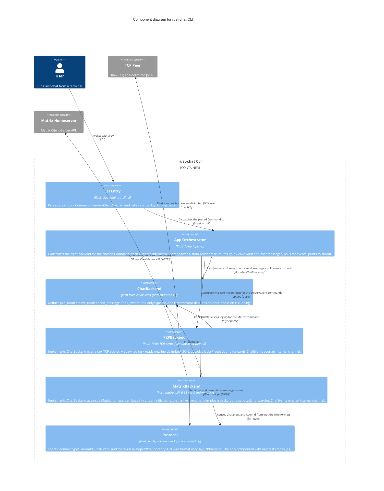

# Level 3 — Component — rust-chat CLI

> **Diagram type**: Component
> **Scope**: The internal components of the `rust-chat CLI` container — CLI parsing, orchestration, the backend abstraction and its two implementations, and the shared protocol module.
> **Audience**: Developers working on this codebase.

## Overview

Inside the single `rust-chat CLI` container, the system is built around one abstraction: the `ChatBackend` trait (`join_room`, `leave_room`, `send_message`, `poll_events`). Everything else follows from it. The **App Orchestrator** never talks to `P2PBackend` or `MatrixBackend` directly except at construction time — for the rest of a session it holds a `Box<dyn ChatBackend>` and calls only trait methods. This is what lets the same interactive loop, the same `/join`/`/leave`/`/quit` handling, and the same event-printing code serve both a raw-TCP chat session and a Matrix session without knowing which one it's driving.

Both backend implementations follow the same internal pattern: a spawned background task owns the actual I/O (a TCP socket reader, or a matrix-sdk sync loop), decodes whatever it receives into a `ChatEvent`, and forwards it over an internal `mpsc` channel (Tokio's multi-producer, single-consumer channel type). `poll_events()` just drains that channel non-blockingly; the App Orchestrator calls it on a ~50ms loop rather than awaiting per-backend futures directly, which is what keeps `ChatBackend`'s interface uniform across two very different transports.

The `Protocol` component is shared, but not equally: `P2PBackend` uses its `WireEnvelope`/`WireContent` JSON wire format directly (it *is* the wire protocol for raw TCP), while `MatrixBackend` only reuses the domain types (`ChatEvent`, `RoomId`) — matrix-sdk owns its own wire format against the Matrix Client-Server API.

## Diagram

## Legend

- **Person / actor**: human user of the system
- **Container boundary** (rounded rectangle): the `rust-chat CLI` container from Level 2
- **Component**: a logical module inside that container (roughly, one `src/` file or directory)
- **External system**: out-of-scope system a component talks to directly
- `mpsc` in component descriptions refers to Tokio's `tokio::sync::mpsc` channel type
- No custom colors or border styles — Mermaid C4 default rendering

## Elements

| Element | Type | Technology | Responsibility |
|---|---|---|---|
| User | Person | — | Invokes the binary with a subcommand; reads/writes via stdin+stdout during the session. |
| CLI Entry | Component | Rust, clap | Parses argv into `Command::{Server, Client, Matrix}`, prints the initial connection message, hands off to the App Orchestrator. |
| App Orchestrator | Component | Rust, Tokio | Owns the interactive session: constructs a backend, spawns the stdin-reader task, drives the `/join`/`/leave`/`/quit`/message loop, polls and prints events. |
| ChatBackend | Component (trait) | Rust trait, async-trait | The abstraction boundary. `#[async_trait]` makes it usable as `Box<dyn ChatBackend>` despite async methods. |
| P2PBackend | Component | Rust, Tokio TCP, serde_json | Raw-TCP transport. Owns a `TcpStream`/socket split, a background line-reader task, and the JSON encode/decode via `WireEnvelope`. |
| MatrixBackend | Component | Rust, matrix-sdk 0.18 | Matrix transport. Owns a matrix-sdk `Client`, a live event handler closure, and a background sync task. |
| Protocol | Component | Rust, serde, chrono, uuid | Domain types (`RoomId`, `ChatEvent`) and the P2P wire format (`WireEnvelope`, `WireContent`, `PROTOCOL_VERSION`). |
| TCP Peer | External System | — | Raw TCP endpoint speaking the same line-delimited JSON protocol. |
| Matrix Homeserver | External System | Matrix Client-Server API | Owns rooms, membership, message history. |

## Key relationships

| From | To | Intent | Protocol / Technology |
|---|---|---|---|
| User | CLI Entry | Invokes with argv | CLI |
| CLI Entry | App Orchestrator | Dispatches the parsed Command to | function call |
| App Orchestrator | P2PBackend | Constructs via `listen()`/`connect()` for the Server/Client commands | async fn call |
| App Orchestrator | MatrixBackend | Constructs via `login()` for the Matrix command | async fn call |
| App Orchestrator | ChatBackend | Calls `join_room`/`leave_room`/`send_message`/`poll_events` through | `Box<dyn ChatBackend>` |
| P2PBackend | ChatBackend | Implements | — |
| MatrixBackend | ChatBackend | Implements | — |
| P2PBackend | Protocol | Serializes and deserializes messages using | `WireEnvelope` (JSON) |
| MatrixBackend | Protocol | Reuses `ChatEvent`/`RoomId` from (not the wire format) | Rust types |
| P2PBackend | TCP Peer | Reads and writes newline-delimited JSON over | raw TCP |
| MatrixBackend | Matrix Homeserver | Logs in, syncs, and sends messages via | Matrix Client-Server API / HTTPS |

## Notable architectural decisions

- **`Box<dyn ChatBackend>` over a generic parameter.** Which backend to construct is a runtime decision — it depends on which CLI subcommand the user picked — not something known at compile time. A generic `run_interactive<B: ChatBackend>` would need the concrete type at the call site, which doesn't exist yet when `Command::Server`/`Client`/`Matrix` are still just enum variants. Dynamic dispatch is the correct call here, not a compromise.
- **`WireEnvelope` is P2P-only, not a universal wire format.** `MatrixBackend` deliberately does not go through `Protocol`'s JSON envelope — matrix-sdk already owns wire-level concerns against the Matrix Client-Server API. `Protocol` only supplies the domain types both backends need to agree on (`ChatEvent`, `RoomId`) so `app.rs` can stay backend-agnostic.
- **Polling instead of a unified async event stream.** Both backends push into an internal `mpsc` channel from a background task, and `poll_events()` just drains it non-blockingly on a fixed ~50ms cadence from the App Orchestrator's loop. This keeps `ChatBackend`'s interface simple and identical across two structurally different transports, at the cost of up to ~50ms of added latency and a busy-ish poll loop rather than a true `select!` over backend-provided futures.
- **Test coverage is uneven.** `Protocol` has 11 unit tests covering `into_chat_event`'s branches, the constructors, `RoomId`, and a JSON round-trip. `P2PBackend` and `MatrixBackend` — where the actual I/O, parsing, and matrix-sdk integration happen — have none yet. This is tracked as ongoing work, not an oversight in this diagram.

## Assumptions

- **CLI Entry as one component spanning two files** (`main.rs` + `cli.rs`) is a grouping choice, not a technical inference — both files together are under 70 lines and splitting them into two components would add boxes without adding information. Flagged here even though it's a naming/grouping call rather than a guess about behavior.
- No other assumptions: every relationship and technology on this diagram is read directly from the current source (`Cargo.toml` and the `src/` tree), not inferred.

## Links to other levels

- ↑ [Level 2 — Container](./02-container.md) — zoom out to the single-container view
- ↑ [Level 1 — System Context](./01-context.md) — zoom out to actors and external systems
